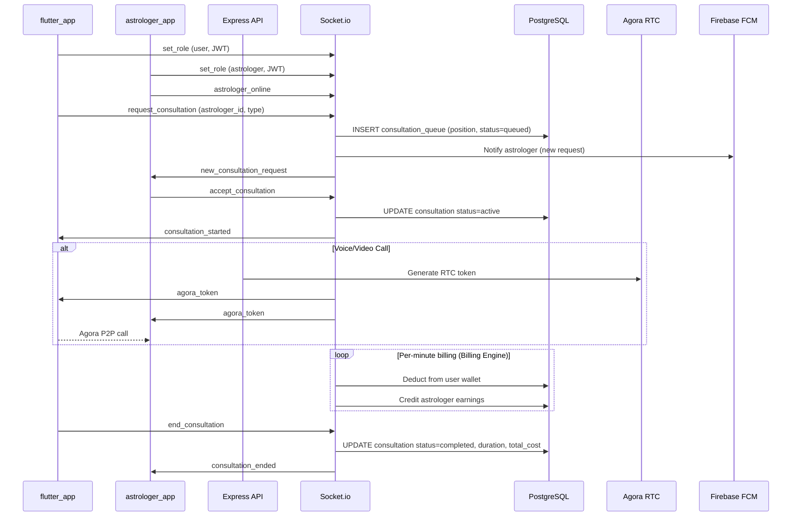
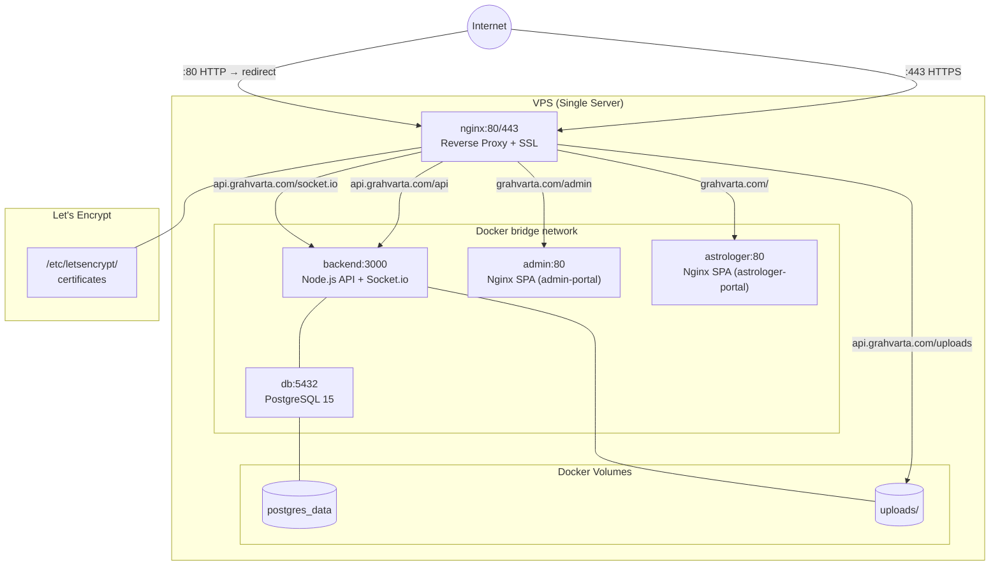
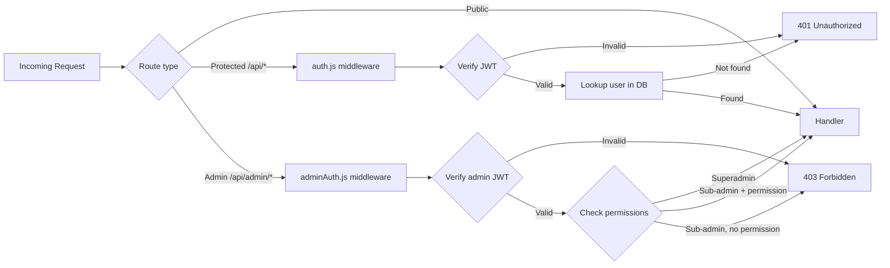

# GrahVarta — Complete Architecture Documentation

## 5.1 Architecture Style

GrahVarta follows a **Feature-based Layered Architecture** across its components:

| Component | Architecture Pattern |
|---|---|
| Backend API | Layered (Routes → Controllers → Services → DB), plus event-driven real-time via Socket.io |
| Flutter Apps | BLoC + Provider hybrid (feature-based screens, shared services layer) |
| Web Portals | React SPA with Context API for auth, Axios for API, component-based pages |
| Infrastructure | Containerized microservices-style deployment (each app in its own container) |

The overall system is a **multi-client platform with a shared backend**, not microservices. All clients (4 apps, 2 portals) hit the same Express.js backend and the same PostgreSQL database.

---

## 5.2 Component Architecture

### Component: Backend API

```
Component:        backend
Responsibility:   All business logic — auth, consultations, wallet, billing, notifications,
                  reports, admin operations, and real-time event coordination
Technology:       Node.js 20, Express.js 4.x, Socket.io 4.x, PostgreSQL 15
Entry Points:     server.js → HTTP server on PORT 3000
Dependencies:     PostgreSQL (pg pool), Firebase Admin SDK, Razorpay, Agora token lib,
                  Nodemailer, node-cron, Multer
Consumers:        flutter_app, astrologer_app, agent_onboarding_app, admin-portal,
                  astrologer-portal (all via HTTPS REST + WebSocket)
External Deps:    Firebase FCM, Razorpay, Stripe, Agora, SMTP server
Data Stores:      PostgreSQL 15 (primary), local filesystem (uploads/)
```

**Internal backend structure:**

```
backend/
  server.js                  # HTTP + Socket.io bootstrap, CORS, rate-limit, static
  src/
    routes/                  # Express route definitions
      auth.js                # /api/auth
      astrologers.js         # /api/astrologers
      consultations.js       # /api/consultations
      wallet.js              # /api/wallet
      reports.js             # /api/reports
      live.js                # /api/live
      threads.js             # /api/threads
      horoscope.js           # /api/horoscope
      content.js             # /api/content
      agora.js               # /api/agora
      withdrawal.js          # /api/withdrawal
      familyMembers.js       # /api/family-members
      admin.js               # /api/admin
      hirings.js             # /api/hirings
    controllers/             # Business logic per domain
    middleware/
      auth.js                # JWT verification, user lookup, premium check
      adminAuth.js           # Admin/sub-admin auth with permission validation
    socket/
      index.js               # Socket.io event handlers, room management, presence
      billingEngine.js       # Real-time per-minute billing during active consultations
    db/
      index.js               # pg Pool configuration (max 20, idle 30s)
    cron/                    # Scheduled tasks (horoscope notifications, billing, queue cleanup)
  migrations/                # 23 ordered .sql migration files
  uploads/                   # Runtime file storage (avatars, documents)
```

---

### Component: flutter_app (User Mobile App)

```
Component:        flutter_app
Responsibility:   End-user experience — horoscopes, marketplace browsing, consultation
                  booking, birth chart reports, wallet management, family profiles
Technology:       Flutter/Dart, min SDK 3.0.0
Entry Points:     lib/main.dart → Firebase init → GoRouter navigation
Dependencies:     Provider, flutter_bloc, socket_io_client, agora_rtc_engine,
                  razorpay_flutter, firebase_messaging, go_router
Consumers:        (End users via Android/iOS)
External Deps:    Backend REST API (https://api.grahvarta.com/api),
                  Socket.io (wss://api.grahvarta.com),
                  Agora (client-side SDK)
Data Stores:      FlutterSecureStorage (JWT token), SharedPreferences (prefs)
```

**Internal structure:**

```
flutter_app/lib/
  main.dart          # Firebase init, FCM setup, local notifications, router bootstrap
  screens/
    auth/            # Login, register, role selection screens
    home/            # Home dashboard, horoscope display
    consultation/    # Chat UI, voice/video call, history
    family/          # Family member CRUD
    birth_chart/     # Report display, unlock flow
  services/
    api_service.dart    # HTTP client, base URL config, token auth headers
    socket_service.dart # Socket.io singleton, reconnect logic, event buffering
  models/            # Dart data classes: User, Astrologer, Consultation, Report, etc.
  providers/         # AuthProvider, ThemeProvider, LocaleProvider
  blocs/             # ChatBloc, HomeBloc, LiveBloc, MarketplaceBloc, ReportsBloc
  widgets/           # Reusable UI: cards, shimmer loaders, buttons, dialogs
  theme/             # Light/dark theme definitions
```

---

### Component: astrologer_app (Astrologer Mobile App)

```
Component:        astrologer_app
Responsibility:   Astrologer-facing app — consultation acceptance, earnings dashboard,
                  withdrawal, live sessions, profile management
Technology:       Flutter/Dart, min SDK 3.0.0 (same stack as flutter_app)
Entry Points:     lib/main.dart
Dependencies:     Same as flutter_app (Provider, BLoC, Socket.io, Agora, FCM)
Data Stores:      FlutterSecureStorage, SharedPreferences
```

---

### Component: agent_onboarding_app (Recruitment App)

```
Component:        agent_onboarding_app
Responsibility:   Simplified onboarding flow for recruiting new astrologers via field agents
Technology:       Flutter/Dart (lightweight — minimal dependencies)
Entry Points:     lib/main.dart
Dependencies:     Firebase Auth, http, image_picker, shared_preferences, flutter_secure_storage
Consumers:        Field agents/recruiters
External Deps:    Backend /api/hirings endpoints
```

---

### Component: admin-portal (Admin Web Dashboard)

```
Component:        admin-portal
Responsibility:   Full platform administration — user management, astrologer approval,
                  financial controls, content moderation, notifications
Technology:       React 18, Vite, Tailwind CSS, React Router DOM v6, Axios, Recharts
Entry Points:     src/main.jsx → BrowserRouter (basename /admin) → App.jsx routes
Dependencies:     AuthContext (JWT in localStorage), Axios interceptors (401→login redirect)
Consumers:        Platform admins and sub-admins
External Deps:    Backend /api/admin/* endpoints
```

**Pages:**

| Route | Page | Access |
|---|---|---|
| `/admin/dashboard` | DashboardPage | All admins |
| `/admin/users` | UsersPage | All admins |
| `/admin/users/:id` | UserDetailPage | All admins |
| `/admin/astrologers` | AstrologersPage | All admins |
| `/admin/reports` | ReportsPage | All admins |
| `/admin/transactions` | TransactionsPage | All admins |
| `/admin/withdrawals` | WithdrawalsPage | All admins |
| `/admin/community` | CommunityPage | All admins |
| `/admin/notifications` | NotificationsPage | All admins |
| `/admin/hirings` | HiringsPage | All admins |
| `/admin/recharge-offers` | RechargeOffersPage | All admins |
| `/admin/sub-admins` | SubadminsPage | **Superadmin only** |

---

### Component: astrologer-portal (Astrologer Web Portal)

```
Component:        astrologer-portal
Responsibility:   Web alternative for astrologers — dashboard, profile, live sessions,
                  community, wallet, consultations
Technology:       React 18, Vite, Tailwind CSS
Entry Points:     src/main.jsx → BrowserRouter
Dependencies:     Axios, Socket.io client, Agora Web SDK
Consumers:        Astrologers via web browser
External Deps:    Backend REST API, Socket.io, Agora
```

---

## 5.3 Component Interaction

```mermaid
graph TD
    subgraph Clients
        FA[flutter_app]
        AA[astrologer_app]
        OA[agent_onboarding_app]
        ADM[admin-portal]
        ASP[astrologer-portal]
    end

    subgraph Backend
        API[Express REST API]
        SOCK[Socket.io Server]
        CRON[node-cron Jobs]
        BLG[Billing Engine]
    end

    subgraph Storage
        PG[(PostgreSQL 15)]
        FS[/uploads - filesystem]
    end

    subgraph ExternalAPIs
        FCM[Firebase FCM]
        RZP[Razorpay]
        STR[Stripe]
        AGR[Agora RTC]
        SMTP[Nodemailer/SMTP]
    end

    FA -->|REST: auth, horoscope, consultations, wallet, reports| API
    AA -->|REST: profile, consultations, earnings, withdrawals| API
    OA -->|REST: /api/hirings| API
    ADM -->|REST: /api/admin/*| API
    ASP -->|REST: profile, live, community, wallet| API

    FA <-->|WebSocket: consultation events, chat, billing| SOCK
    AA <-->|WebSocket: consultation events, presence, billing| SOCK
    ASP <-->|WebSocket: consultation events, live| SOCK

    API --> PG
    API --> FS
    SOCK --> PG
    SOCK --- BLG
    BLG --> PG
    CRON --> PG
    CRON --> FCM

    API --> FCM
    API --> RZP
    API --> STR
    API --> AGR
    API --> SMTP
```

---

## 5.4 Request Lifecycle — Consultation Flow



---

## 5.4 Deployment Architecture



**Container summary:**

| Container | Image | Port (internal) | Purpose |
|---|---|---|---|
| `db` | postgres:15 | 5432 | Primary data store |
| `backend` | custom Node 20 Alpine | 3000 | REST API + Socket.io |
| `admin` | custom Nginx Alpine | 80 | Admin portal SPA |
| `astrologer` | custom Nginx Alpine | 80 | Astrologer portal SPA |
| `nginx` | nginx:alpine | 80, 443 | SSL termination, routing |

---

## 5.5 Authentication & Authorization



**Token lifecycle:**
- Issued on login/register, expires per `JWT_EXPIRES_IN` (default: 30 days)
- Mobile apps store in `FlutterSecureStorage`
- Web portals store in `localStorage`
- Socket.io connections authenticate via `auth.token` in handshake

---

## 5.6 Cron Jobs

| Schedule | Job | Action |
|---|---|---|
| Daily 7:00 AM | Horoscope Notification | Generate daily horoscope and send FCM push to all users |
| Hourly | Withdrawal Processing | Process approved withdrawal requests that are due |
| Every 10 min | Queue Cleanup | Mark consultations queued >10 min as expired, notify users |

---

## 5.7 File Upload Architecture

```
Client (flutter_app / portals)
    └──> POST /api/auth/avatar (multipart/form-data)
         └──> Multer middleware
              └──> Saves to /uploads/{type}/{filename}
                   └──> Served by Nginx at /uploads/* (7-day cache)
```

Max file size: 10 MB (configurable via `MAX_FILE_SIZE` env var).
