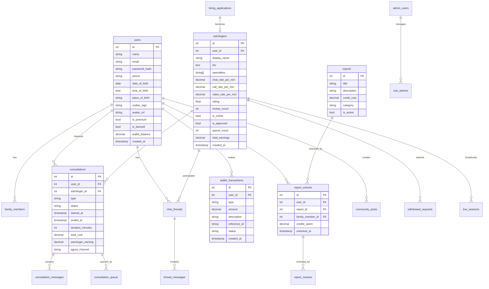

# GrahVarta — Database Data Model

**Database**: PostgreSQL 15  
**Schema**: Derived from 23 migration files in `backend/migrations/`  
**Connection Pool**: 20 max connections, 30s idle timeout

---

## Entity Relationship Overview

---

## Core Tables

### `users`
Primary user account table.

| Column | Type | Description |
|---|---|---|
| `id` | SERIAL PK | Auto-increment identifier |
| `name` | VARCHAR | Display name |
| `email` | VARCHAR UNIQUE | Login email |
| `password_hash` | VARCHAR | bcrypt hash (12 rounds) |
| `phone` | VARCHAR | Contact number |
| `date_of_birth` | DATE | For horoscope and reports |
| `time_of_birth` | TIME | For birth chart reports |
| `place_of_birth` | VARCHAR | Birth city/location |
| `zodiac_sign` | VARCHAR | Derived from DOB (Aries, Taurus, etc.) |
| `avatar_url` | VARCHAR | Profile photo path |
| `is_premium` | BOOLEAN | Premium subscription status |
| `is_banned` | BOOLEAN | Account ban flag |
| `wallet_balance` | DECIMAL(10,2) | Current wallet balance |
| `fcm_token` | VARCHAR | Firebase push token |
| `app_type` | VARCHAR | 'user' or 'astrologer' |
| `created_at` | TIMESTAMP | Account creation timestamp |

---

### `astrologers`
Astrologer professional profile, separate from the base user record.

| Column | Type | Description |
|---|---|---|
| `id` | SERIAL PK | |
| `user_id` | INT FK → users | Linked user account |
| `display_name` | VARCHAR | Professional name |
| `bio` | TEXT | Profile description |
| `specialties` | TEXT[] | Array of expertise areas |
| `experience_years` | INT | Years of practice |
| `languages` | TEXT[] | Languages spoken |
| `chat_rate_per_min` | DECIMAL | Rate (in credits) per minute for chat |
| `call_rate_per_min` | DECIMAL | Rate for voice calls |
| `video_rate_per_min` | DECIMAL | Rate for video calls |
| `rating` | FLOAT | Average rating (0.0–5.0) |
| `review_count` | INT | Total review count |
| `is_online` | BOOLEAN | Real-time availability |
| `is_approved` | BOOLEAN | Admin approval status |
| `queue_count` | INT | Active queue depth |
| `total_earnings` | DECIMAL | Lifetime platform earnings |
| `bank_details` | JSONB | Bank account for withdrawals |

---

### `consultations`
Tracks every consultation session lifecycle.

| Column | Type | Description |
|---|---|---|
| `id` | SERIAL PK | |
| `user_id` | INT FK → users | Requesting user |
| `astrologer_id` | INT FK → astrologers | Serving astrologer |
| `type` | ENUM | `chat`, `voice`, `video` |
| `status` | ENUM | `queued`, `active`, `completed`, `cancelled`, `expired` |
| `started_at` | TIMESTAMP | When session became active |
| `ended_at` | TIMESTAMP | Session end time |
| `duration_minutes` | INT | Billed duration |
| `total_cost` | DECIMAL | Total deducted from user wallet |
| `astrologer_earning` | DECIMAL | Astrologer's share |
| `agora_channel` | VARCHAR | Agora RTC channel name for video/voice |

---

### `consultation_messages`
Individual messages within a consultation chat.

| Column | Type | Description |
|---|---|---|
| `id` | SERIAL PK | |
| `consultation_id` | INT FK | Parent consultation |
| `sender_id` | INT FK → users | Message sender |
| `sender_role` | ENUM | `user`, `astrologer` |
| `message` | TEXT | Message content |
| `created_at` | TIMESTAMP | |

---

### `consultation_queue`
Tracks queued consultation requests and their position.

| Column | Type | Description |
|---|---|---|
| `id` | SERIAL PK | |
| `consultation_id` | INT FK | Linked consultation |
| `astrologer_id` | INT FK | Target astrologer |
| `user_id` | INT FK | Requesting user |
| `position` | INT | Queue position |
| `status` | ENUM | `waiting`, `accepted`, `expired` |
| `queued_at` | TIMESTAMP | Entry time (used by cleanup cron) |

---

### `wallet_transactions`
Immutable ledger of all monetary events.

| Column | Type | Description |
|---|---|---|
| `id` | SERIAL PK | |
| `user_id` | INT FK | Wallet owner |
| `type` | ENUM | `recharge`, `consultation_debit`, `refund`, `subscription`, `bonus` |
| `amount` | DECIMAL | Transaction amount |
| `description` | TEXT | Human-readable description |
| `reference_id` | VARCHAR | Razorpay/Stripe payment ID |
| `status` | ENUM | `pending`, `completed`, `failed` |
| `created_at` | TIMESTAMP | |

---

### `chat_threads`
Persistent conversation thread between a user and an astrologer (survives individual consultations).

| Column | Type | Description |
|---|---|---|
| `id` | SERIAL PK | |
| `user_id` | INT FK | |
| `astrologer_id` | INT FK | |
| `created_at` | TIMESTAMP | |
| `last_message_at` | TIMESTAMP | |

**Constraint**: One thread per user-astrologer pair.

---

### `thread_messages`
All messages across all consultations in a thread.

| Column | Type | Description |
|---|---|---|
| `id` | SERIAL PK | |
| `thread_id` | INT FK | Parent thread |
| `consultation_id` | INT FK | Which consultation this belongs to |
| `sender_id` | INT FK | |
| `sender_role` | ENUM | `user`, `astrologer` |
| `message` | TEXT | |
| `created_at` | TIMESTAMP | |

---

### `family_members`
User-defined profiles for birth chart reports on family members.

| Column | Type | Description |
|---|---|---|
| `id` | SERIAL PK | |
| `user_id` | INT FK | Owner |
| `name` | VARCHAR | Family member name |
| `relation` | VARCHAR | e.g., "spouse", "child" |
| `date_of_birth` | DATE | |
| `time_of_birth` | TIME | |
| `place_of_birth` | VARCHAR | |
| `created_at` | TIMESTAMP | |

---

### `reports`
Admin-defined birth chart report templates.

| Column | Type | Description |
|---|---|---|
| `id` | SERIAL PK | |
| `title` | VARCHAR | Report name (e.g., "Career Report") |
| `description` | TEXT | What the report covers |
| `credit_cost` | DECIMAL | Credits to unlock |
| `category` | VARCHAR | Report category |
| `content_template` | TEXT | Report content / template |
| `is_active` | BOOLEAN | Visibility toggle |

> 16+ report types confirmed from migration (Life Guidance, Career, Marriage, Wealth, etc.)

---

### `report_unlocks`
Tracks which users have purchased which reports.

| Column | Type | Description |
|---|---|---|
| `id` | SERIAL PK | |
| `user_id` | INT FK | |
| `report_id` | INT FK | |
| `family_member_id` | INT FK (nullable) | If for a family member |
| `credits_spent` | DECIMAL | Amount paid at time of unlock |
| `unlocked_at` | TIMESTAMP | |

---

### `admin_users`
Platform superadmins.

| Column | Type | Description |
|---|---|---|
| `id` | SERIAL PK | |
| `email` | VARCHAR UNIQUE | Login email |
| `password_hash` | VARCHAR | bcrypt hash |
| `name` | VARCHAR | |
| `role` | ENUM | `superadmin` |
| `created_at` | TIMESTAMP | |

---

### `sub_admins`
Role-based sub-administrators with granular permissions.

| Column | Type | Description |
|---|---|---|
| `id` | SERIAL PK | |
| `email` | VARCHAR UNIQUE | |
| `password_hash` | VARCHAR | |
| `name` | VARCHAR | |
| `permissions` | JSONB | Array of permission strings |
| `is_active` | BOOLEAN | |
| `created_at` | TIMESTAMP | |

**Example permissions**: `["users.view", "astrologers.approve", "withdrawals.approve", "community.moderate"]`

---

### `withdrawal_requests`
Astrologer payout requests.

| Column | Type | Description |
|---|---|---|
| `id` | SERIAL PK | |
| `astrologer_id` | INT FK | |
| `amount` | DECIMAL | Requested amount |
| `status` | ENUM | `pending`, `approved`, `rejected`, `processed` |
| `bank_details` | JSONB | Snapshot of bank info at request time |
| `requested_at` | TIMESTAMP | |
| `processed_at` | TIMESTAMP | |
| `admin_note` | TEXT | Reason for rejection, etc. |

---

### `hiring_applications`
Agent onboarding workflow tracking.

| Column | Type | Description |
|---|---|---|
| `id` | SERIAL PK | |
| `name` | VARCHAR | Applicant name |
| `phone` | VARCHAR | |
| `email` | VARCHAR | |
| `specialties` | TEXT[] | Declared expertise |
| `experience_years` | INT | |
| `documents` | JSONB | Uploaded document URLs |
| `status` | ENUM | `pending`, `approved`, `rejected`, `active` |
| `agent_id` | INT | ID of recruiting agent |
| `submitted_at` | TIMESTAMP | |
| `reviewed_at` | TIMESTAMP | |

---

## Migration History

| File | Purpose |
|---|---|
| `001_initial.sql` | users table, zodiac signs, base auth |
| `002_marketplace.sql` | astrologers, consultations, wallet, subscriptions |
| `003_chat_threads.sql` | chat_threads and thread_messages |
| `003_family_members.sql` | family_members table |
| `004_reports.sql` | reports and report_unlocks |
| `005_admin.sql` | admin_users and sub_admins |
| `006_community_moderation.sql` | community posts, moderation flags |
| `007_withdrawals.sql` | withdrawal_requests |
| `008_push_token_app_type.sql` | FCM token with app_type column |
| `010_agent_hirings.sql` | hiring_applications |
| `011–023` | Incremental schema additions (status flags, permissions, password fields, etc.) |

---

## Key Design Decisions

1. **Wallet as balance column**: User wallet is a single `wallet_balance` decimal on the `users` table, with all mutations recorded in `wallet_transactions` for auditability.
2. **Per-minute billing is real-time**: The billing engine (Socket.io) updates `wallet_balance` and `astrologer_earning` every minute during active consultations — not in a batch job.
3. **Thread vs Consultation**: Consultations are ephemeral sessions. `chat_threads` persist the history permanently between user-astrologer pairs.
4. **Astrologers extend Users**: An astrologer has a `users` row for auth and an `astrologers` row for their professional profile.
5. **JSONB for permissions**: Sub-admin permissions stored as JSONB array for flexible role definitions without schema changes.
6. **Queue cleanup is cron-based**: Queued consultations older than 10 minutes are expired by a cron job, not by the socket handler.
