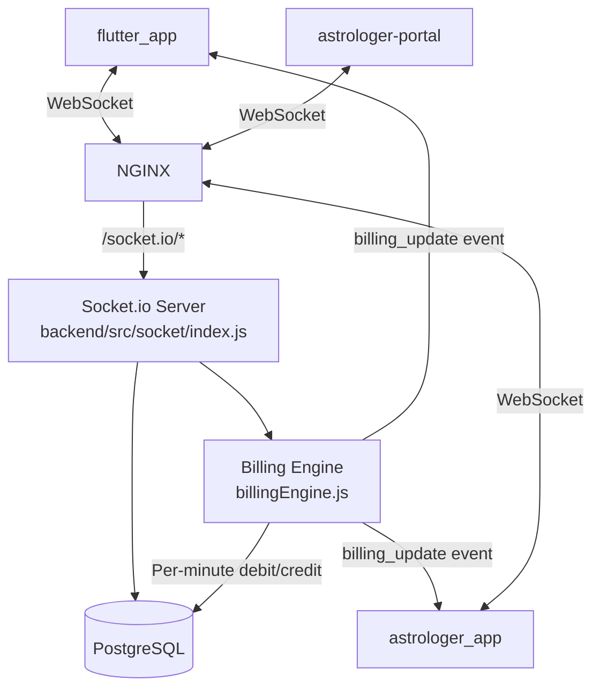
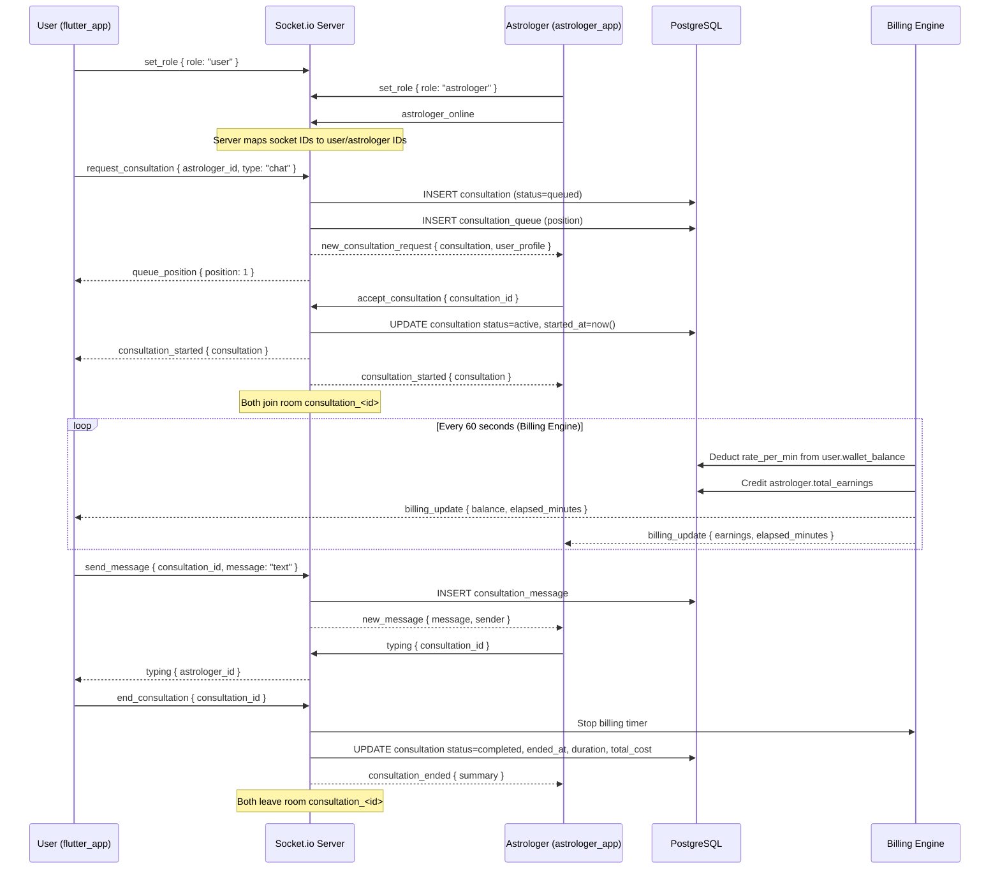
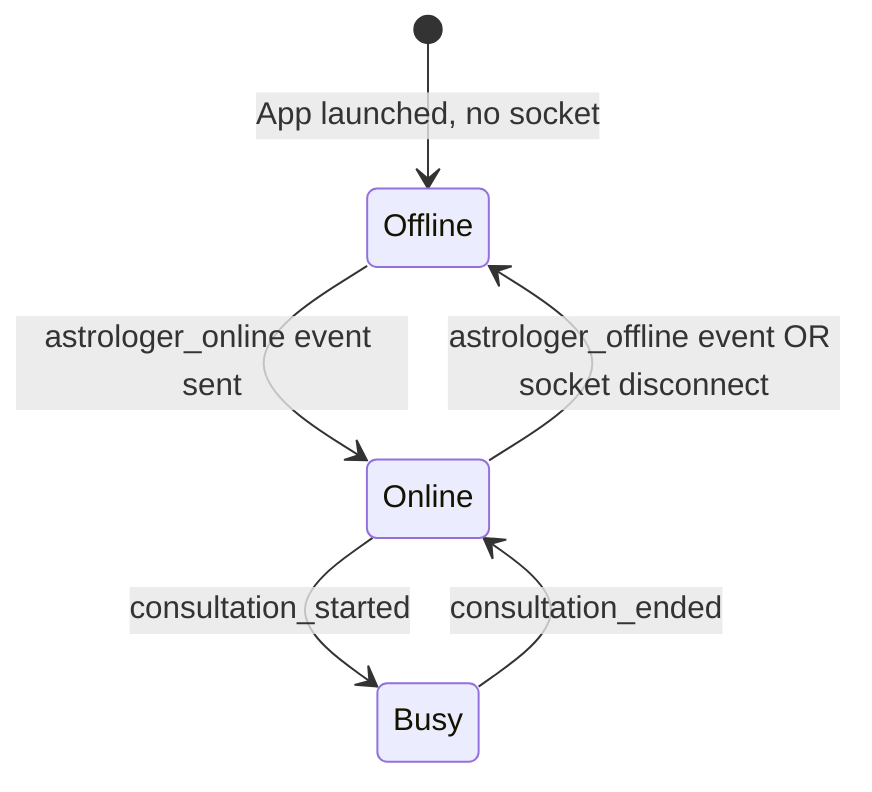

# GrahVarta — Real-Time System Documentation

## Overview

GrahVarta's real-time layer is built on **Socket.io 4.x** running on the same Node.js process as the REST API. It powers:

- Consultation lifecycle (request → queue → active → end)
- Real-time per-minute billing during active sessions
- Chat message delivery with typing indicators
- Astrologer presence (online/offline)
- Queue position updates for waiting users

**Connection endpoint**: `wss://api.grahvarta.com` (WebSocket with HTTP polling fallback)

---

## Architecture



---

## Connection & Authentication

Clients connect with a JWT in the Socket.io handshake auth:

```dart
// Flutter (socket_service.dart)
IO.io(socketUrl, OptionBuilder()
  .setTransports(['websocket'])
  .setAuth({'token': jwtToken})
  .enableReconnection()
  .setReconnectionDelay(3000)
  .setReconnectionDelayMax(30000)
  .build()
);
```

The server verifies the JWT on the `connection` event and associates the socket with the user's ID. Invalid tokens result in immediate disconnection.

---

## Socket Rooms

| Room | Members | Purpose |
|---|---|---|
| `consultation_<id>` | User + Astrologer | Message isolation per session |
| `astrologer_<id>` | Astrologer only | Targeted requests and admin pushes |
| `user_<id>` | User only | Queue position updates |

---

## Event Flow — Full Consultation Lifecycle



---

## Billing Engine (`billingEngine.js`)

The billing engine runs a `setInterval` (60 seconds) for each active consultation.

```
On consultation_started:
  → Start interval for consultation_id
  → Each tick:
      → Read astrologer rate_per_min for type (chat/call/video)
      → BEGIN TRANSACTION
          → Deduct rate from user.wallet_balance
          → Add rate × platform_factor to astrologer.total_earnings
          → INSERT wallet_transaction (type=consultation_debit)
      → COMMIT
      → Emit billing_update to user socket
      → Emit billing_update to astrologer socket
      → If user.wallet_balance < rate_per_min:
          → Auto-end consultation (insufficient funds)

On end_consultation:
  → clearInterval for consultation_id
  → Write final consultation record (duration, total_cost)
```

**Insufficient funds handling**: When the user's balance drops below the next tick's cost, the billing engine automatically ends the consultation and notifies both parties.

---

## Presence System

Astrologer online/offline state is maintained in-memory on the Socket.io server (stored in a Map) and persisted to the `astrologers.is_online` column in PostgreSQL.



Users browsing the marketplace see `is_online` status from the database (REST API), which is updated on every presence event.

---

## Reconnection Strategy

The Flutter `socket_service.dart` implements exponential backoff:

| Attempt | Delay |
|---|---|
| 1st reconnect | 3 seconds |
| 2nd reconnect | ~6 seconds |
| Max delay | 30 seconds |
| Max attempts | Unlimited |

**During reconnection**: Events are buffered client-side and replayed on successful reconnect. Active consultations resume billing from the server state (billing engine continues server-side regardless of client connectivity).

---

## Socket.io Server Configuration (`server.js`)

```javascript
// CORS for WebSocket connections
const io = new Server(server, {
  cors: {
    origin: allowedOrigins,
    credentials: true
  }
});
```

Nginx forwards WebSocket upgrade headers:

```nginx
location /socket.io/ {
  proxy_pass http://backend:3000;
  proxy_http_version 1.1;
  proxy_set_header Upgrade $http_upgrade;
  proxy_set_header Connection "upgrade";
}
```

---

## FCM Push Notifications (Async Complement)

Socket.io handles real-time events when the app is open. **Firebase Cloud Messaging (FCM)** handles push notifications when the app is in background or closed:

| Trigger | FCM notification |
|---|---|
| New consultation request (astrologer) | "New consultation request from [User]" |
| Consultation started | "Your consultation has started" |
| New chat message | "New message from [Name]" |
| Daily horoscope (cron, 7 AM) | "Your daily horoscope is ready" |
| Withdrawal approved | "Your withdrawal of ₹X has been processed" |

FCM tokens are registered per-device, per-app (user vs astrologer) on login via `POST /api/auth/fcm-token`.

---

## Key Files

| File | Purpose |
|---|---|
| `backend/src/socket/index.js` | All Socket.io event handlers, room management, presence |
| `backend/src/socket/billingEngine.js` | Per-minute billing during active consultations |
| `flutter_app/lib/services/socket_service.dart` | Flutter Socket.io client singleton |
| `astrologer_app/lib/services/socket_service.dart` | Astrologer app socket client |
| `backend/server.js` | Socket.io server bootstrap, CORS config |
