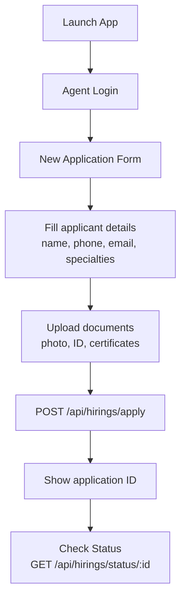

# GrahVarta — Flutter Applications

GrahVarta has three Flutter applications sharing a common technology stack.

---

## Technology Foundation

| Property | Value |
|---|---|
| Framework | Flutter (Dart) |
| Min SDK | 3.0.0 (`flutter_app`, `astrologer_app`) |
| State Management | Provider + BLoC hybrid |
| Navigation | GoRouter 17.x |
| HTTP | http ^1.1.2 |
| Real-time | socket_io_client |
| Secure Storage | flutter_secure_storage |
| Notifications | firebase_messaging + flutter_local_notifications |
| Video/Voice | agora_rtc_engine |
| Payments | razorpay_flutter |
| Images | image_picker, cached_network_image |

---

## flutter_app — User Application

**Location**: `/flutter_app/`  
**Version**: 2.0.0+2  
**Target users**: End users seeking astrology services

### Project Structure

```
flutter_app/lib/
├── main.dart                    # Entry point: Firebase init, FCM, routing
├── screens/
│   ├── auth/                    # Login, register, role selector
│   ├── home/                    # Home dashboard, horoscope widget
│   ├── consultation/            # Chat UI, voice/video call, history
│   ├── family/                  # Family member CRUD
│   └── birth_chart/             # Report list, detail, unlock flow
├── services/
│   ├── api_service.dart         # HTTP client, auth headers, all API calls
│   └── socket_service.dart      # Socket.io singleton, reconnection, events
├── models/                      # User, Astrologer, Consultation, Report, etc.
├── providers/
│   ├── auth_provider.dart       # Login state, user profile, JWT storage
│   ├── theme_provider.dart      # Light/dark mode
│   └── locale_provider.dart     # Language selection
├── blocs/
│   ├── chat_bloc.dart           # Consultation chat state
│   ├── home_bloc.dart           # Dashboard data loading
│   ├── live_bloc.dart           # Live session state
│   ├── marketplace_bloc.dart    # Astrologer listing, filters
│   └── reports_bloc.dart        # Report list and unlock flow
├── widgets/                     # Shared UI components
└── theme/                       # Color schemes, text styles
```

### App Startup (`main.dart`)

```dart
// Order of initialization:
1. WidgetsFlutterBinding.ensureInitialized()
2. Firebase.initializeApp()
3. FirebaseMessaging.onBackgroundMessage(handler)
4. Request FCM permissions
5. Get FCM token → POST /api/auth/fcm-token
6. Setup local notifications (Android channels)
7. runApp(MultiProvider([AuthProvider, ThemeProvider, LocaleProvider]))
8. GoRouter navigation
```

### API Service (`api_service.dart`)

- **Base URL**: `https://api.grahvarta.com/api`
- **Socket URL**: `https://api.grahvarta.com`
- Token read from `FlutterSecureStorage` on every request
- `Authorization: Bearer <token>` header injected automatically
- Throws typed exceptions for 401 (auto-logout), 4xx, 5xx

### Socket Service (`socket_service.dart`)

- Singleton pattern (`SocketService.instance`)
- `connect(token)` — called after login
- `disconnect()` — called on logout
- Exponential backoff: 3s → 30s max delay
- Events emitted via public methods: `requestConsultation()`, `sendMessage()`, etc.
- Callbacks registered via `on(event, handler)` pattern

### Supported Languages

English, Hindi, Tamil, Kannada, Malayalam, Gujarati, Marathi, Bengali, Telugu

Locale files in `lib/l10n/` (ARB format). Language selection persisted via `SharedPreferences`.

### Push Notification Handling

| App State | Mechanism |
|---|---|
| Foreground | `FirebaseMessaging.onMessage` → local notification |
| Background | FCM background handler → system notification |
| Terminated | FCM data payload → `getInitialMessage()` on launch |

Notifications navigate to the relevant screen via the global `NavigatorKey`.

---

## astrologer_app — Astrologer Application

**Location**: `/astrologer_app/`  
**Version**: 2.0.0+2  
**Target users**: Professional astrologers on the platform  
**CI/CD**: Codemagic (`codemagic.yaml`)

### Differences from flutter_app

| Feature | flutter_app | astrologer_app |
|---|---|---|
| Role | User | Astrologer |
| Dashboard | Horoscope + marketplace | Earnings + queue + stats |
| Consultations | Request sessions | Accept/decline incoming |
| Wallet | Recharge + spend | Earn + withdraw |
| Notifications | Appointment, horoscope | New consultation request |
| Live sessions | View/attend | Create and broadcast |

### Astrologer-specific Screens

```
lib/screens/
├── auth/                    # Login, register, pending approval
├── dashboard/               # Earnings, queue count, today's sessions
├── consultations/           # Incoming requests, active session, history
├── wallet/                  # Balance, earning breakdown
├── withdrawal/              # Submit withdrawal request
└── profile/
    ├── profile_setup.dart   # Initial profile + expertise areas
    └── availability.dart    # Toggle online/offline
```

### Codemagic CI/CD (`codemagic.yaml`)

Automated build pipeline for the astrologer app:
- Triggered on push to `main`
- `flutter build apk --release`
- Signs with upload keystore (`android/upload-keystore.jks`)
- Distributes to testers or Play Store

---

## agent_onboarding_app — Recruitment Application

**Location**: `/agent_onboarding_app/`  
**Version**: 1.0.0+1  
**Target users**: Field agents recruiting new astrologers

### Purpose

A lightweight Flutter app used by GrahVarta's recruitment agents to onboard new astrologers in the field. Simpler than the full astrologer app — primarily a form-based flow with document uploads.

### Dependencies (minimal)

```yaml
dependencies:
  firebase_core: ^3.x
  firebase_auth: ^5.x
  http: ^1.x
  image_picker: ^1.x
  shared_preferences: ^2.x
  flutter_secure_storage: ^10.x
```

### Onboarding Flow



### API Integration

Only two backend endpoints used:
- `POST /api/hirings/apply` — submit application with document uploads
- `GET /api/hirings/status/:id` — poll application status

Applications are reviewed in the **Admin Portal → Hirings** section. Once approved, the admin activates the applicant as an astrologer.

---

## Build Instructions

### Debug

```bash
flutter pub get
flutter run
```

### Release APK

```bash
# Per-ABI split (recommended for Play Store)
flutter build apk --release --split-per-abi

# Universal APK
flutter build apk --release
```

Output: `build/app/outputs/flutter-apk/`

### Release AAB (Play Store)

```bash
flutter build appbundle --release
```

Output: `build/app/outputs/bundle/release/app-release.aab`

### Android Keystore

The `agent_onboarding_app` has a keystore at `android/upload-keystore.jks`. Keystore passwords should be stored in `android/key.properties` (not committed).

---

## Firebase Configuration

Each app has its own `google-services.json` in `android/app/`.

Firebase projects used:
- **Project**: `grahvarta-astrology` (confirmed from `flutter_app/main.dart`)
- **Services used**: Firebase Messaging (FCM), Firebase Auth (agent_onboarding_app)

FCM token registration flow:
1. App obtains token via `FirebaseMessaging.instance.getToken()`
2. Token posted to `POST /api/auth/fcm-token` with `app_type` field (`user` or `astrologer`)
3. Backend stores token in `users.fcm_token` with associated app type
4. Backend uses token for targeted push notifications

---

## State Management Patterns

### Provider (global state)

Used for app-wide state that needs to survive navigation:
- `AuthProvider` — current user, login/logout
- `ThemeProvider` — dark/light mode
- `LocaleProvider` — selected language

### BLoC (feature state)

Used for screen-level state machines with events and states:

| BLoC | Events | States |
|---|---|---|
| `ChatBloc` | LoadMessages, SendMessage, NewMessage | Loading, Loaded, Sending |
| `HomeBloc` | LoadDashboard | Loading, Loaded, Error |
| `MarketplaceBloc` | LoadAstrologers, FilterChanged | Loading, Loaded, Filtered |
| `ReportsBloc` | LoadReports, UnlockReport | Loading, Loaded, Unlocking, Unlocked |
| `LiveBloc` | LoadSessions, JoinSession | Loading, Active, Ended |
